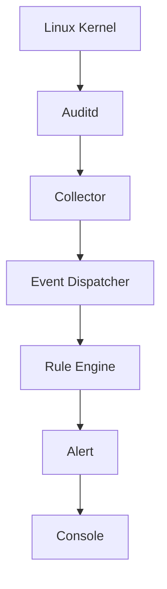

# 📁 Mini-EDR Agent 노트

> Linux Audit 이벤트를 수집하고, 행위 기반 탐지 규칙을 통해 의심스러운 시스템 활동을 탐지하는 Go 기반 경량 EDR 에이전트

---

## 🧾 프로젝트 정보
- 프로젝트 형태: 개인 프로젝트(Linux 시스템·보안 에이전트 개발)
- 개발 기간: 2026.06 ~ 2026.07
- 개발 환경: Ubuntu Linux
- 개발 언어: Go
- 실행 환경:
   - Intel Pentium E5400
   - DDR3 2GB Memory
   - 250GB SATA HDD
- 결과:
   - Linux Audit 로그 실시간 수집 및 이벤트 조립 구조 구현
   - Collector → Dispatcher → Rule Engine → Alert 파이프라인 구현
   - MITRE ATT&CK를 참고한 행위 기반 탐지 규칙 8개 구현

📄 **PDF 문서**  
- [Mini-EDR 통합 보고서](https://github.com/Hwang-Injun34/elasticsearch_notes/blob/main/Politi-Search_%E1%84%90%E1%85%A9%E1%86%BC%E1%84%92%E1%85%A1%E1%86%B8_%E1%84%87%E1%85%A9%E1%84%80%E1%85%A9%E1%84%89%E1%85%A5_%E1%84%82%E1%85%A1%E1%86%B7%E1%84%80%E1%85%AE%E1%86%BC%E1%84%86%E1%85%A7%E1%86%BC%E1%84%89%E1%85%AE.pdf)

▶️ **시연 영상**  
- [시연 영상]()

---

## 📌 프로젝트 개요
Mini-EDR은 Linux환경에서 발생하는 프로세스 실행, 파일 생성·삭제, 네트워크 연결, 프로세스 접근 및 권한 변경 등의 
이벤트를 수집하고 분석하는 경량 보안 에이전트입니다. 

Linux에서 기본적으로 제공하는 Audit Framework를 활용하여 시스템 호출 기반의 이벤트를 수집하고, 
Go로 구현한 사용자 공간 에이전트에서 이를 정형화된 이벤트로 변환합니다. 

변환된 이벤트는 JSON 형식의 탐지 규칙과 비교되며, 의심스러운 행위를 발견하면 Alert를 생성하여 콘솔에 출력합니다. 

단순히 시스템 호출의 발생 여부만 확인하는 것이 아니라, 실행 파일, 부모 프로세스, 명령행 인자, 파일 경로, 목적지 IP와 포트 등의 
정보를 함께 분석하여 행위 기반 탐지를 수행하도록 설계했습니다. 

---

## 🚨 문제 정의
Linux에서는 프로세스 생성, 파일 접근, 네트워크 연결과 같은 다양한 시스템 활동이 지속적으로 발생합니다. 
하지만 Auditd가 생성하는 원본 로그는 하나의 사건이 여러 Record로 분리되어 기록되므로 그대로는 탐지에 활용하기 어렵습니다. 
예를 들어 하나의 프로세스 실행 이벤트도 다음과 같은 여러 Audit Record로 나뉠 수 있습니다. 
- SYSCALL
- EXECVE
- PATH
- CWD
- PROCTITLE

따라서 보안 이벤트를 분석하려면 다음과 같은 문제가 해결되어야 합니다. 
- 분리된 Audit Record를 하나의 이벤트로 조립해야 함
- 이벤트마다 서로 다른 로그 구조를 공통 형식으로 변환해야 함
- 정상 행위와 의심스러운 행위를 구분할 탐지 규칙이 필요함
- 지속적으로 발생하는 이벤트를 처리하면서 수집 지연을 줄여야 함
- 저사양 환경에서도 동작할 수 있도록 자원 사용을 고려해야 함
- 탐지 로직과 출력·저장·대응 로직의 책임을 분리해야 함

---

## 💡 해결 전략
- Linux Audit Framework를 활용한 시스템 호출 기반 이벤트 수집
- Audit Event ID를 기준으로 분리된 Record 조립
- 공통 이벤트 모델인 SystemEvent 설계
- Go의 Goroutine과 Channel을 활용한 비동기 파이프라인 구성
- JSON 기반 탐지 규칙을 통한 규칙 확장 구조 구현
- MITRE ATT&CK Detection Strategy 기반 행위 탐지 규칙 설계
- Rule Engine과 Rule Matcher의 책임 분리
- 탐지와 후처리를 분리하기 위한 Alert 계층 설계
- 명령행 인자를 토큰 단위로 비교하여 단순 문자열 비교의 오탐 감소

---

## 🏗 시스템 구조

각 컴포넌트는 Goroutine으로 독립적으로 실행되며, Channel을 통해 이벤트를 전달한다. 
- Collector: Audit 로그 수집 및 동일 Event ID의 Record 조립
- Dispatcher: Audit Event를 공통 SystemEvent 모델로 변환
- Rule Engine: SystemEvent와 JSON 탐지 규칙 비교
- Alert: 탐지 결과를 전달받아 콘솔에 출력

---

## 🛡 구현한 탐지 규칙
MITRE ATT&CK의 Detection Strategy를 참고하여 다음 8개의 행위 기반 탐지 규칙을 구현했습니다.
- 의심스러운 명령 실행 탐지
- 의심스러운 외부 네트워크 연결 탐지
- Systemd 서비스 파일 생성 탐지
- 시스템 로그 파일 삭제 탐지
- Ptrace 기반 프로세스 접근 탐지
- setuid, setgid 기반 권한 상승 탐지
- Udev Rule 기반 Persistence 탐지
- SSH authorized_keys 변경 탐지

---

## ⚠️ 현재 구현 범위
현재 버전에서는 다음 범위까지 구현했습니다.
이벤트 수집 → 이벤트 변환 → 규칙 기반 탐지 → 콘솔 경고
데이터베이스 저장, Dashboard, 프로세스 종료, 파일 격리 및 네트워크 차단 기능은 향후 확장 대상으로 구분했습니다.

---

## 🛠 기술 스택
- Go
- Ubuntu Linux
- Linux Audit Framework, Auditd

---

## 🗂 정리 방식
- ▶️ **시연 영상**: MP4
- 📄 **이론 & 개념, 보고서**: PDF
- 🔗  **실습 & 코드**: GitHub

